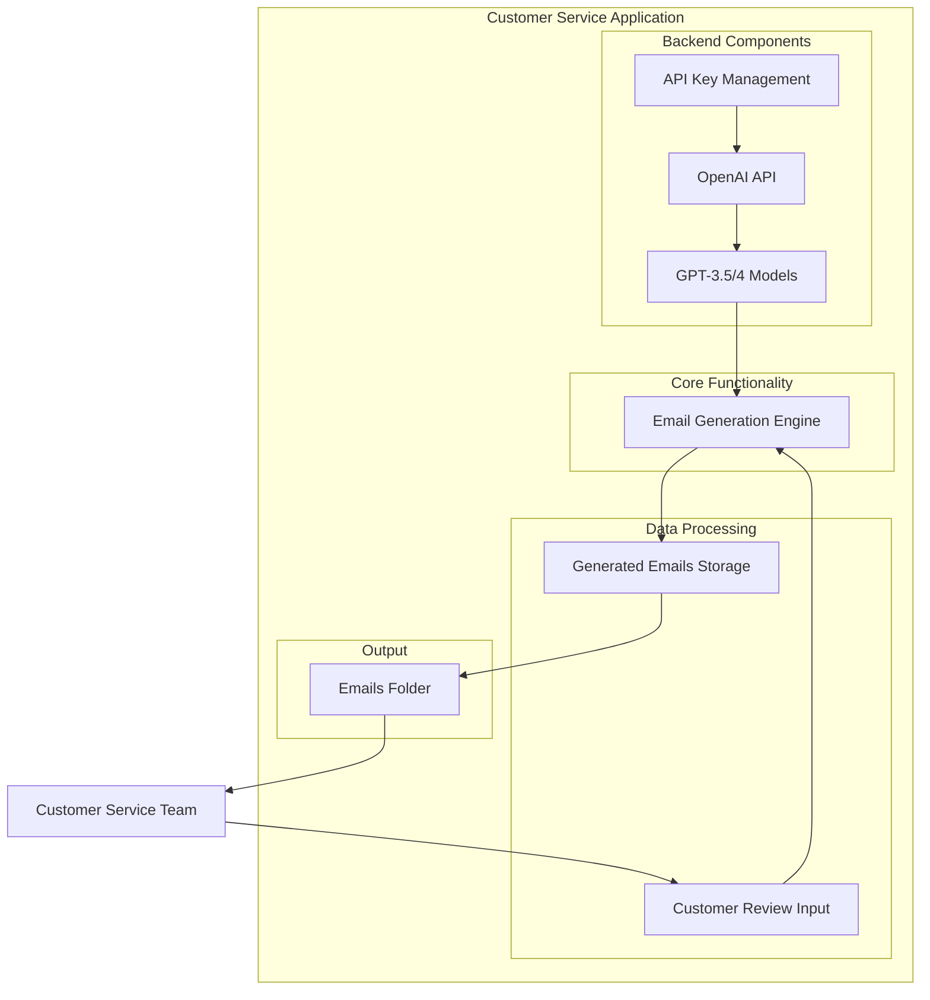
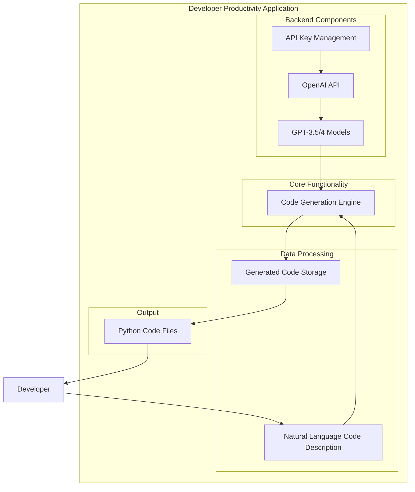
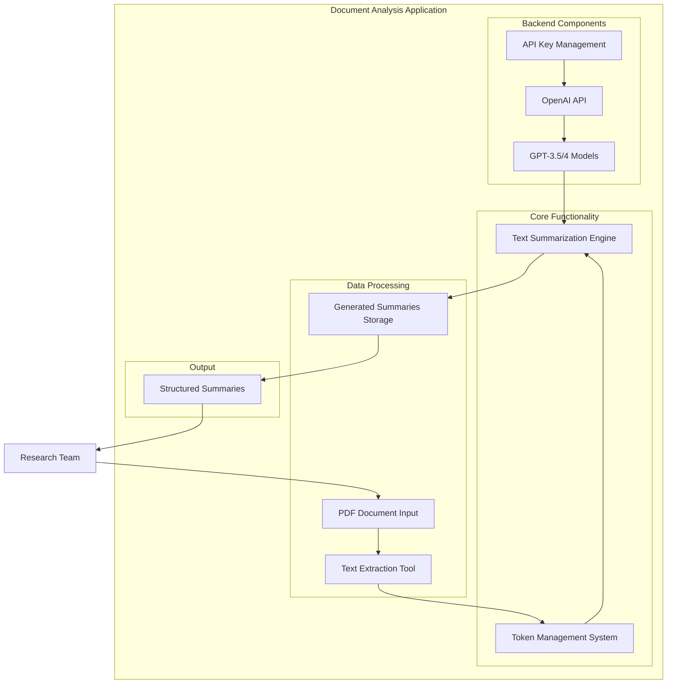

# Demo Script: OpenAI's API for business and development tasks

## Session Overview (45 minutes)

**Presenter:** [Your Name]  
**Date:** May 10, 2025  
**Duration:** 45 minutes

---

## Introduction (5 minutes)

### Opening (2 minutes)

- Welcome participants to the session
- Introduce yourself and your background
- Share the session objectives:
  - Demonstrate OpenAI API capabilities for business tasks
  - Show practical applications for email generation and code creation
  - Showcase the Creative AI Mini Kit's functionality

### Overview of Creative AI Mini Kit (3 minutes)

- Explain what the Creative AI Mini Kit is:
  - A compact toolkit leveraging OpenAI's models
  - Built for AI-driven creativity and efficiency
  - Includes features for email response automation, code generation, and document processing
- Briefly explain the tech stack:
  - Python with OpenAI API
  - Django web application (optional mention if time permits)
- Introduce the three business scenarios we'll demonstrate:
  1. Customer service email automation
  2. Developer productivity with code generation
  3. Knowledge management with document summarization

### Architecture Diagrams

#### 1. Customer Service Scenario: Email Response Automation



#### 2. Development Scenario: Code Generation



#### 3. Knowledge Management Scenario: Document Processing



---

## Part 1: Environment Setup (5 minutes)

### Required Libraries Walkthrough (2 minutes)

- Show the import section of the notebook
- Explain key libraries:

  ```python
  from openai import OpenAI
  import pandas as pd
  import tiktoken
  from IPython.display import Image, Markdown, display
  import os
  ```

- Briefly explain why each is important for the demo

### API Configuration (3 minutes)

- Demonstrate how to set up OpenAI API key
- Show how to configure the OpenAI client
- Explain best practices for API key management (environment variables)
- Set up folder structure for outputs

---

## Part 2: Email Generation from Customer Reviews (15 minutes)

### Business Scenario 1: Customer Service Automation (2 minutes)

- Refer to the Customer Service architecture diagram
- Business problem: Responding to customer reviews efficiently
- Value proposition: Save time while maintaining personalization
- Demo structure: From customer reviews to professional emails

### Loading and Processing Reviews (3 minutes)

- Show how to:
  - Read customer reviews from text files
  - Create a structured DataFrame for processing
  - Display sample reviews to the audience

### Generating Response Emails (5 minutes)

- Demonstrate the API call to OpenAI
- Explain the system prompt and importance of clear instructions
- Show how the email generation function works:

  ```python
  def getMail(review):
      chat_history = chat.copy()
      chat_history.append({"role": "user", "content": review+postfix})
      reply = client.chat.completions.create(
          model="gpt-3.5-turbo-1106",
          messages=chat_history
      )
      return reply.choices[0].message.content
  ```

### Results Analysis (5 minutes)

- Review generated emails:
  - Show examples of positive review responses
  - Show examples of addressing customer concerns
  - Highlight professional tone and personalization
- Discuss business impact:
  - Time savings
  - Consistency in customer communication
  - Scalability for support teams

---

## Part 3: Code Generation from Natural Language (15 minutes)

### Business Scenario 2: Developer Productivity (2 minutes)

- Refer to the Developer Productivity architecture diagram
- Business problem: Streamlining development process
- Value proposition: From requirement to working code
- Use cases: Prototyping, solving common problems, learning

### Code Generation Function (3 minutes)

- Walk through the code generation function:

  ```python
  def generate_python_code(description):
      system_prompt = """You are an expert Python programmer..."""
      chat_messages = [
          {"role": "system", "content": system_prompt},
          {"role": "user", "content": f"Generate Python code for: {description}"}
      ]
      response = client.chat.completions.create(
          model="gpt-3.5-turbo-1106",
          messages=chat_messages
      )
      return response.choices[0].message.content
  ```

- Explain the importance of the system prompt for quality results

### Demonstrations (10 minutes)

- Show examples of generated code for:
  1. Data processing (CSV file processing example)
  2. Algorithm implementation (binary search or sorting)
  3. Custom implementation (word frequency counter)
- Highlight features of the generated code:
  - Proper documentation
  - Error handling
  - Efficient implementations
  - Adherence to best practices
- Demonstrate saving code to files with timestamps

---

## Part 4: Document Processing and Summarization (10 minutes)

### Business Scenario 3: Knowledge Management (2 minutes)

- Refer to the Document Analysis architecture diagram
- Business problem: Extracting key information from lengthy documents
- Value proposition: Quickly digest research papers, reports, and technical documents
- Demo structure: From PDF processing to concise, structured summaries

### PDF Processing and Token Analysis (3 minutes)

- Show how to:
  - Download and process PDF files
  - Extract text from PDFs using PyPDF
  - Count tokens to manage API limitations

```python
def num_tokens_from_string(text, encoding_name):
    encoding = tiktoken.get_encoding(encoding_name)
    num_tokens = len(encoding.encode(text))
    return num_tokens
```

- Explain the importance of token management for cost control and efficiency

### Advanced Summarization Techniques (5 minutes)

- Demonstrate the text summarization function:

```python
def summarize_text(text, max_tokens=4000):
    # Truncate text if it's too long
    encoding = tiktoken.get_encoding('cl100k_base')
    tokens = encoding.encode(text)
    
    if len(tokens) > max_tokens:
        print(f"⚠️ Text is too long ({len(tokens)} tokens). Truncating to {max_tokens} tokens.")
        truncated_tokens = tokens[:max_tokens]
        text = encoding.decode(truncated_tokens)
    
    # Create system and user messages with specific instruction for structure
    system_message = """You are an expert at summarizing..."""
    user_message = f"""Please provide a clear summary with these sections:
    1. Main Topic and Purpose
    2. Key Concepts Introduced
    3. Methodology
    4. Main Findings or Contributions"""
    
    # Generate the summary using OpenAI API
    chat_messages = [...]
    response = client.chat.completions.create(...)
    
    return response.choices[0].message.content
```

- Show organized file structure with dedicated folder for summaries
- Explain how system prompts create structured, consistent summaries

### Business Use Cases for Summarization (3 minutes)

- Show example summarized content:
  - Research paper (Attention is All You Need)
  - Company brochures or reports
- Discuss business applications:
  - Research acceleration for academic or R&D teams
  - Knowledge management for organizations
  - Competitive intelligence analysis
  - Due diligence automation

---

## Conclusion (5 minutes)

### Recap of Demonstrated Capabilities (2 minutes)

- Summarize what we've demonstrated:
  - Email generation for customer service
  - Code generation for development tasks
  - Text summarization for document processing
  - The power of properly structured prompts

### Potential Business Applications (2 minutes)

- Customer service automation
- Developer productivity enhancement
- Content generation for marketing
- Knowledge management

### Q&A Preparation (1 minute)

- What to expect in the Q&A session
- Additional resources available

---

## Live Demo Tips

### Pre-Demo Preparation

- Ensure OpenAI API key is properly set up
- Run the notebook cells in advance to verify everything works
- Have example reviews and code prompts ready to demonstrate
- Prepare backup examples in case of API issues

### Technical Setup

- Use a local environment with all dependencies installed
- Have a backup internet connection if possible
- Keep the API documentation handy for reference

### Presentation Tips

- Explain concepts before showing code
- Use simple, relatable examples
- Highlight business value, not just technical implementation
- Be prepared for common questions about:
  - API costs and rate limits
  - Data privacy and security
  - Integration with existing systems
  - Customization for specific business needs

---

## Example Demonstrations

### Email Generation Examples

- Positive product review: Hiking boots or headphones example
- Mixed review: Jacket with sizing issues
- Detailed review: Smart watch with multiple points

### Code Generation Examples

- Data analysis: Sales data processing function
- Algorithm: Binary search implementation
- Utility function: Text analysis or data transformation

---

### Flexibility Note

This script is flexible - adjust timing based on audience engagement and questions.
